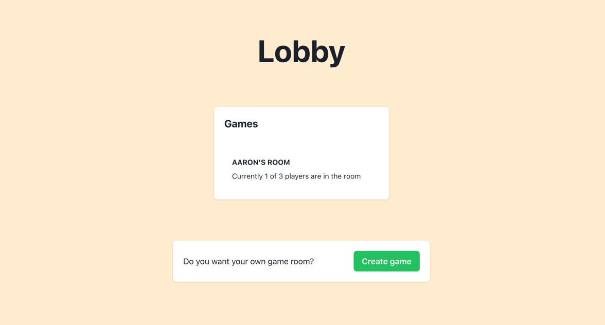
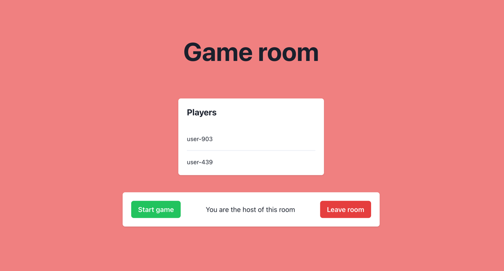

# Simple card game app built with Expo Router

I want to create a simple app for mobile devices that allows you to swipe through cards with questions. It should be
possible to play with multiple players (multiplayer support).

The cards will be generated from a list of questions. The questions will be fetched from an API or generated with
OpenAI.

Also, I want to try out the new [Expo Router](https://expo.github.io/router) package.

## 🥅 Goal of the project

I want to create a simple app for mobile devices that allows you to swipe through cards with questions.
It should be possible to play with multiple players (multiplayer support).

I start with a web app and then I will try to port it to mobile devices. I use Turborepo so I can share code between the
Mobile and Web app.

## ✏️ ToDo

- [x] Create a simple `Swiper` / `Card` component
- [x] Add multiplayer support with [Colyseus](https://www.colyseus.io/)
- [ ] Get questions from [Open Trivia DB](https://opentdb.com/)
- [ ] Generate questions with [OpenAI](https://openai.com/)
- [ ] Add a menu screen
- [ ] Add a scoreboard
- [ ] Add a timer
- [ ] Add a chat

## 💯 Other cool thingies

_Unrelated to the project, but for inspiration..._

- Generate cards from [Deck of Cards API](https://deckofcardsapi.com/)
- [Supabase](https://supabase.io/) for realtime database management + authentication
- [Appwrite](https://appwrite.io/) for realtime database management + authentication + graphql

## 📝 Notes

- [Expo Router: Docs](https://expo.github.io/router)
- [Expo Router: Repo](https://github.com/expo/router)

## 📸 Screenshots

